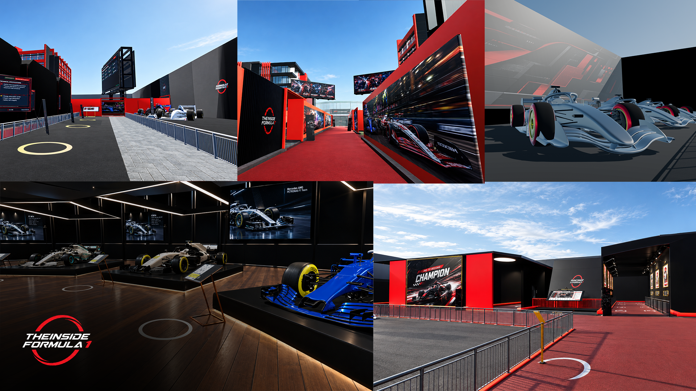
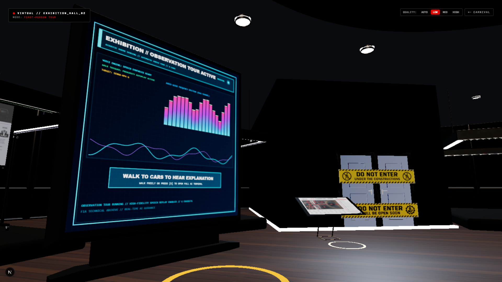
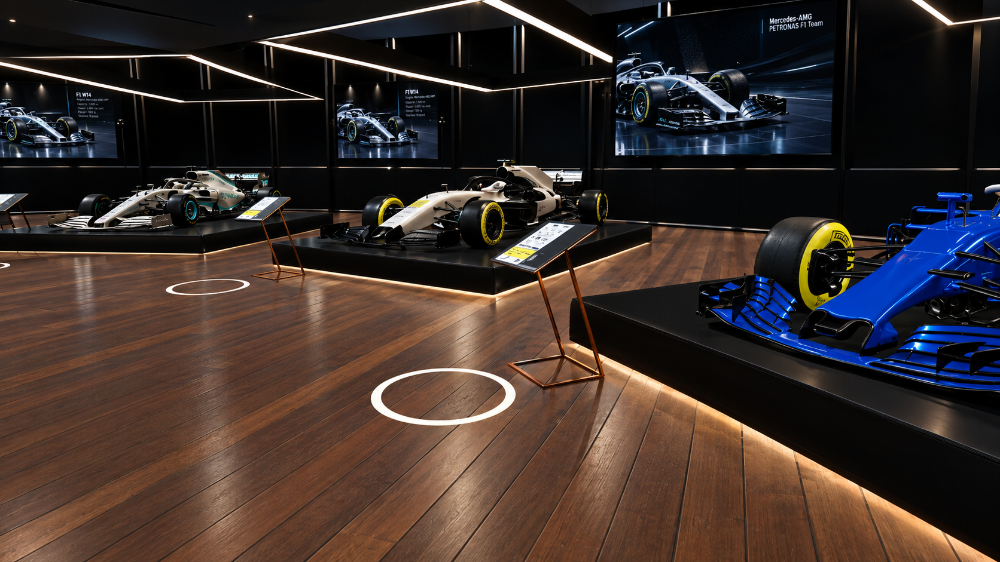
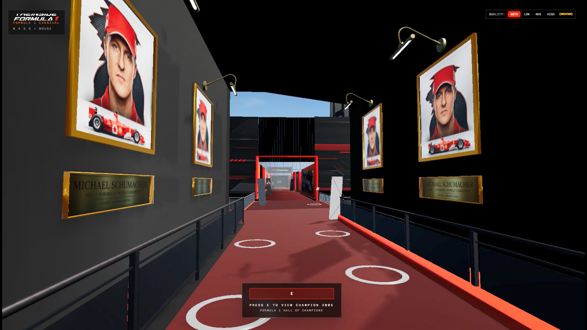
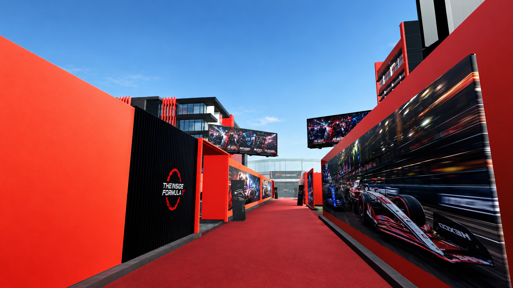
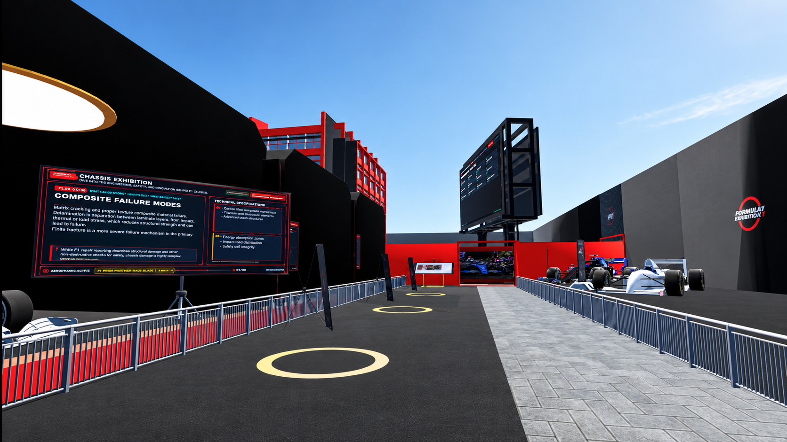
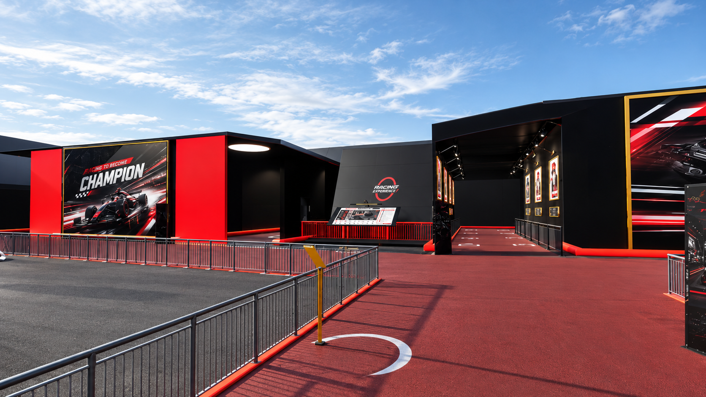
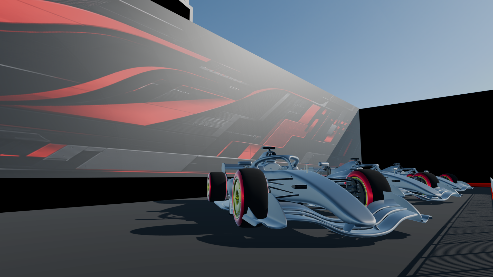

# The Inside Formula One — Carnival Screenshots

> A visual overview of the interactive Formula One Carnival environment and its major areas.

## Carnival Overview

### Main Carnival Scene

The main cover image presents the Formula One Carnival environment, showing the overall exhibition aesthetic, vehicle displays, and the branded in-world layout.

### Formula One Exhibition Entrance

This view shows the central exhibition and carnival structure, with vehicle presentation, signage, and the large Formula One design language of the environment.

## Exhibition Area

### Exhibition Hall and Vehicle Display

The Exhibition Hall presents Formula One vehicles as interactive display objects with information-rich presentation and observation-focused layout.

## Championship and Educational Areas

### Championship / Historical Zone

This still highlights the championship-focused area, demonstrating the historical and showcase elements of the experience.

### Educational / Technical Display Section

This frame captures an informational or educational area of the carnival with a more technical exhibition presentation.

## Additional Environment Views

### Additional Carnival Still

This still highlights another segment of the carnival environment and demonstrates the consistency of the venue design.

### Additional Scenic Presentation

This shot demonstrates the wider Formula One visual language used across the environment and supports the project’s immersion-focused presentation.

### Additional Interactive Environment Detail

This final still provides an additional look at the interactive exhibition environment and the spatial design of the carnival layout.

## Notes

These images are the current public asset references for the project and should be treated as the authoritative visual set for this documentation. They are used directly as provided and are not altered or replaced.
